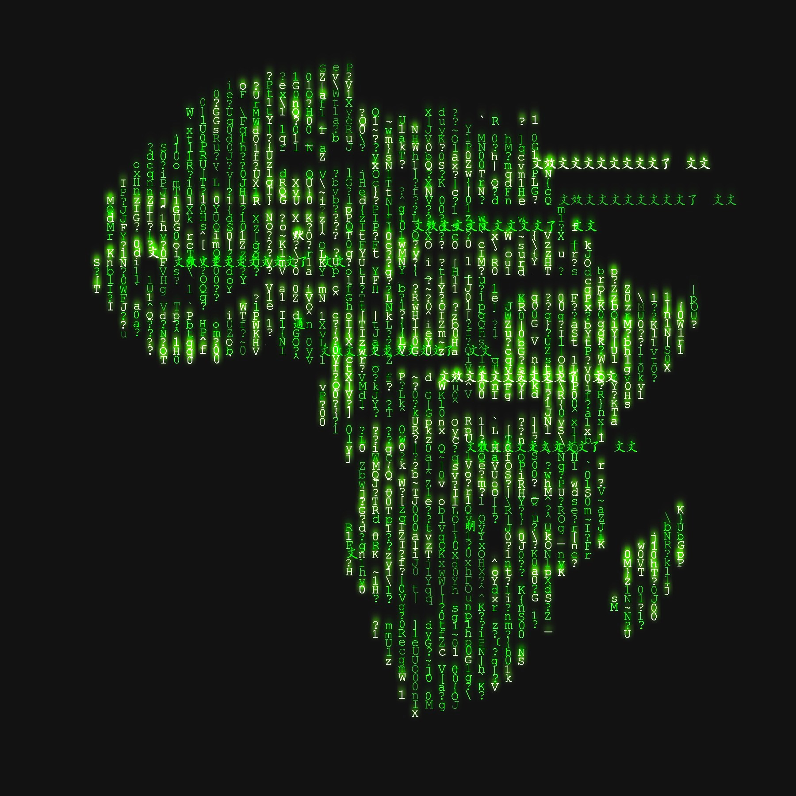

# Welcome to Africa OSINT

In the room, we investigate the practice of various OSINT techniques that have been used in Africa. This is important for Image intelligence, geospatial intelligence, social networks, search engines, Language translation, and other OSINT. This room is appropriate for those of you who have just learned about your different OSINT journey. 

## What is OSINT?

**OSINT** is an open-source intelligence that involves collecting of and analyzing of information/data available to the public. These can include social media, newspapers, and even online tools. 

**This room will present to you how to start using OSINT.**

+ By learning the great resources and different challenges (OSINT) [[1]](https://tryhackme.com/room/searchlightosint) [[2]](https://tryhackme.com/room/sakura) [[3]](https://tryhackme.com/room/ohsint) rooms from TryHackMe and other online platforms.
+ To develop a growth mindset and improve logical thinking skills.
+ Concentrating on the [OSINT framework](https://osintframework.com/) using free tools to gather information.
+ Using OSINT tools to facilitate localization, translation, and other tools based on an image, video, and text before answering questions.

The flag format is: **A-THM{flag}** this means that each answer should be submitted in square brackets (Note: no need to submit an answer without "A") 

If you are stuck inside this room, ask for help in the TryHackMe discord. You may also  find me on Twitter and I can give you additional  information :)

**Here is the answer to the question: Tayari**

# Task 1
1. Do you understand the flag format? Hint: A-THM{???}

# Task 2

## First Challenge

1. Where was the first picture taken? 
2. What time did the bridge show in the second picture open? Hint: A-THM{MONTH-DAY-YEAR}
3. On what planet in Star Wars was the third photo taken place? Hint: A-THM{city, country, planet in Star-Wars}
4. Where was the fourth picture captured?
5. Where was that last picture taken? Hint: The Rock between Europe and Africa.

# Task 3

## Second Challenge

Background of fiction
I am Ikhlas Otoo. I'm a professional artist-researcher.
I published the history of art in West Africa and I am working on organized business conferences but I'm mostly known for the exploration of traditional African art. I have been analyzing African clay sculpture.

“African art is functional; it serves a purpose. It's not a dormant. It's not a means to collect the largest cheering section. It should be healing, a source a joy. Spreading positive vibrations.”
-- Mos Def

1. Where the IP Owner 154[.]73[.]167[.]188 is from?
2. Decode the following elements: NDEuMTg5LjE5Mi4w in order to find out what is the country's currency?
3. Decode the following; <)un;9e^g3;H-+]AQ2Pb<)umdA5t?N:fK,3 - to identify the Latitude and Longitude encoded?
4. [Research] What are the four types of attacks In Equatorial Guinea and Cameroon that have been carried out since at least mid-2017? Hint: See who writes the comment.

# Task 4

## Third Challenge

Dear customer,

As you are aware Internet connection does not work properly because of technical issues after a power outage. We apologise for any disturbance. The IT team recognises the business effect of the outage and shares the frustration.  

We experience downtime in extremely rare cases and feel deeply sorry for the incidents. A full explanation of the technical problem can be found in the blog: hxxps[://]www[.]mtn[.]co[.]ug/

If you have any questions, please do not hesitate to contact our customer support. 

Sincerely.

Mtn teams

1. In which city is the street shown on the glitch picture and under what name the street is registered?
2. On what date was the site first captured by the archive? (DD-MM-YYYY)
3. [Research] Which network was used as the first mobile operator in Mozambique and what was its technical e-mail contact? Hint: Defang URL!
4. What are the dialling codes for Rwanda, Ethiopia, and Madagascar?
5. [Research] How to translate "no worries" in Swahili? Hint: Attempt to translate 1337

# Task 5

## Fourth Challenge

1. Which airline operates every day flight from Johannesburg to Victoria Falls at 10:50 AM and what is the flight number?
2. What is the route of the flight BOT323/BP323?
3. What UN/LOCODE two ports are in Namibia?
4. Which four of the following are license plates of Eswatini?
  1) SC 141 07
  2) OSD 613 AL
  3) ASD 143 CM
  4) KBW 1337 
  5) UBB 420U
  6) HSD 936 BM
  7) PM RF 1991
  8) NSD 337 AH
  9) SD CD 342

# Task 6

## Fifth Challenge

1. Name the regions of the African Union from challenges #1 to #5? Hint: Attempt to translate 1337 :)

# Task 7

## Conclusion

As you know OSINT is the technique of collecting accessible information from the public and you still focus on the OSINT framework to use tools from various rooms and platforms. This room is created with the goal for the participants to have fun and to learn some facts about Africa. If you enjoyed doing the given tasks, please leave your comment. As this is my first attempt to build the room I would appreciate any good words or criticism.

