**1. the target is to find each image by using reverse image tool such as Google, Yandex etc.**
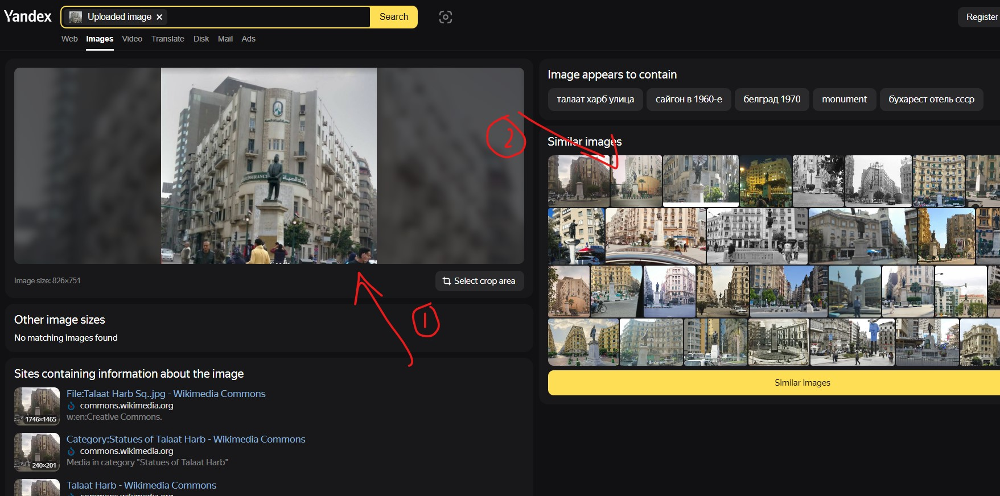

Found Halaat Harb Square
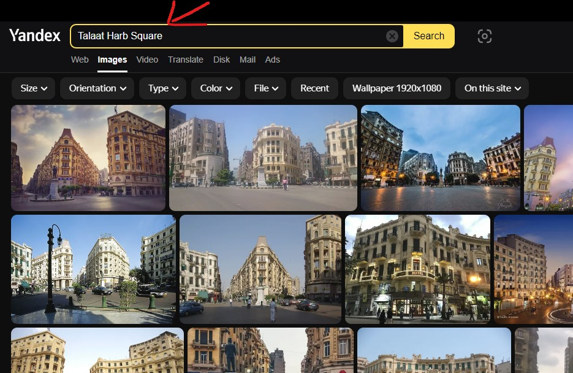

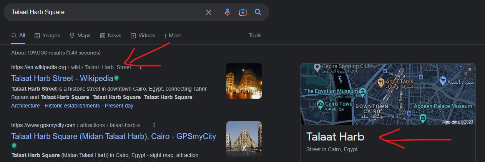
Googled the Talaat Harb Square then found Talaat Harb Street on Wiki

**Where was the first picture taken?**
**A-THM{Talaat Harb Street, Cairo, Egypt}**

**2.What time did the bridge shown in the second picture open?**
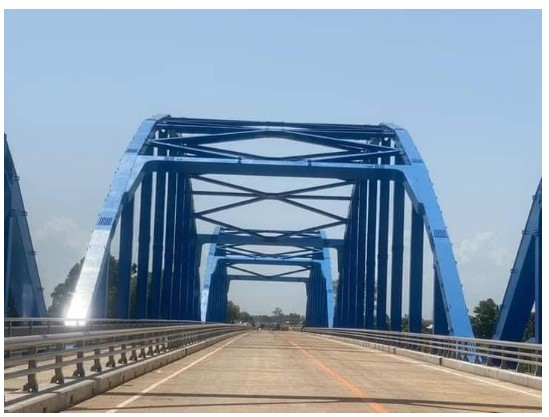

Using Google, Yandex etc.

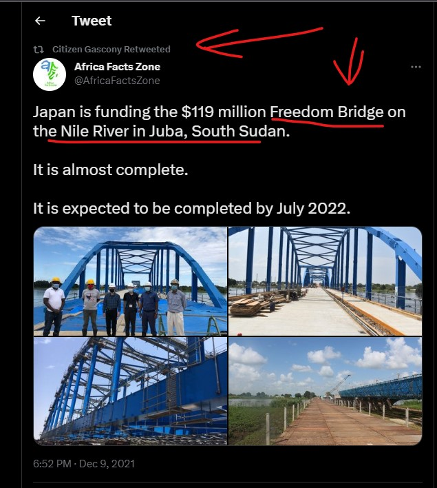
Found Freedom Bridge on the Nile River in Juba, South Sudan. Googling Freedom Bridge in South Sudan.
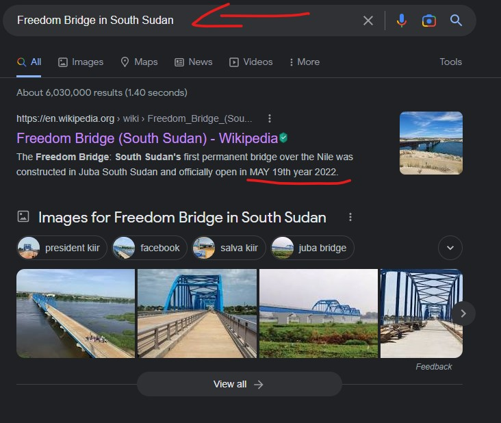
**Bingo!**

**What time did the bridge show in the second picture open? Hint: A-THM{MONTH-DAY-YEAR}**
**A-THM{MAY-19-2022}**

**3. On what planet in Star Wars was the third photo taken place? Using Google, Yandex, etc**

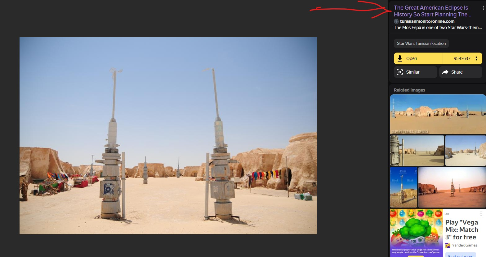
**https://www.tunisianmonitoronline.com/index.php/2018/08/21/the-great-american-eclipse-is-history-so-start-planning-the-eclipse-of-the-century-in-tatouine/**
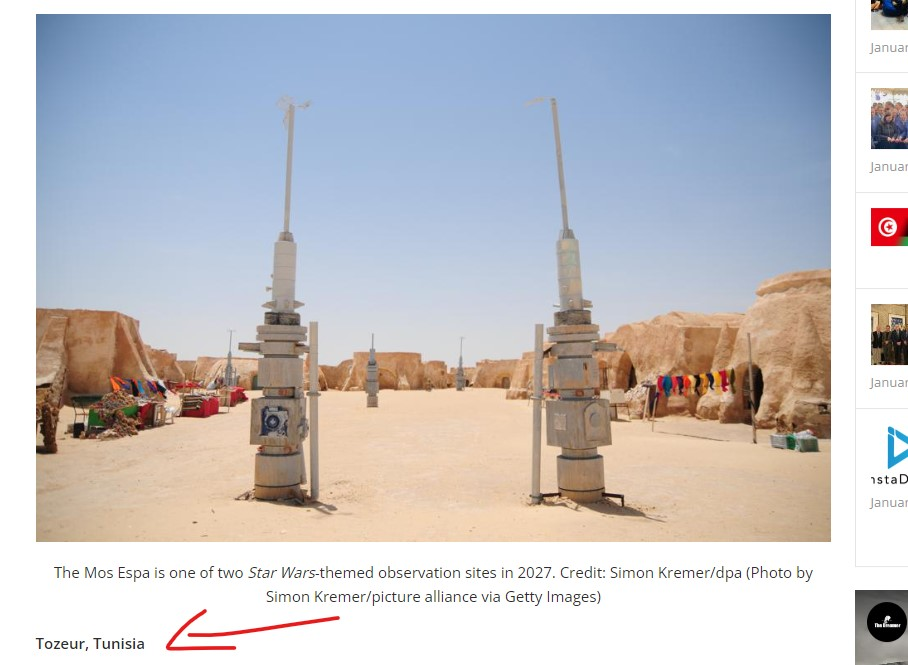
The answer about planet in Star Wars should include one more detail.
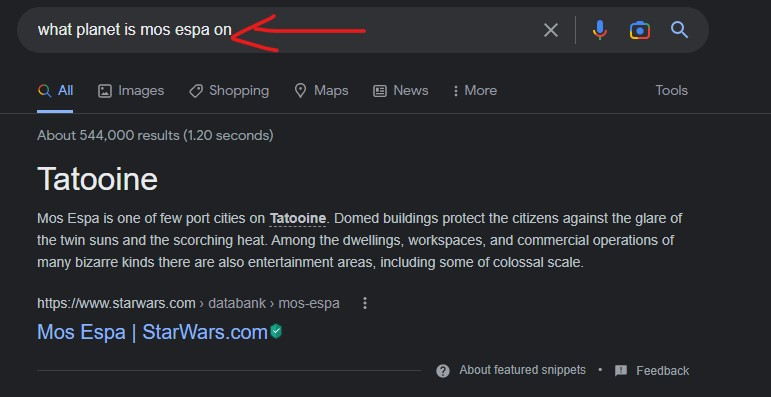
Bingo!
**A-THM{Tozeur, Tunisia, Tatooine}**

**4. Where was the fourth picture captured?**

1) Use select to crop area on the uploaded image
2) Drag area tower from image
3) Bingo! Found the image of the same building.
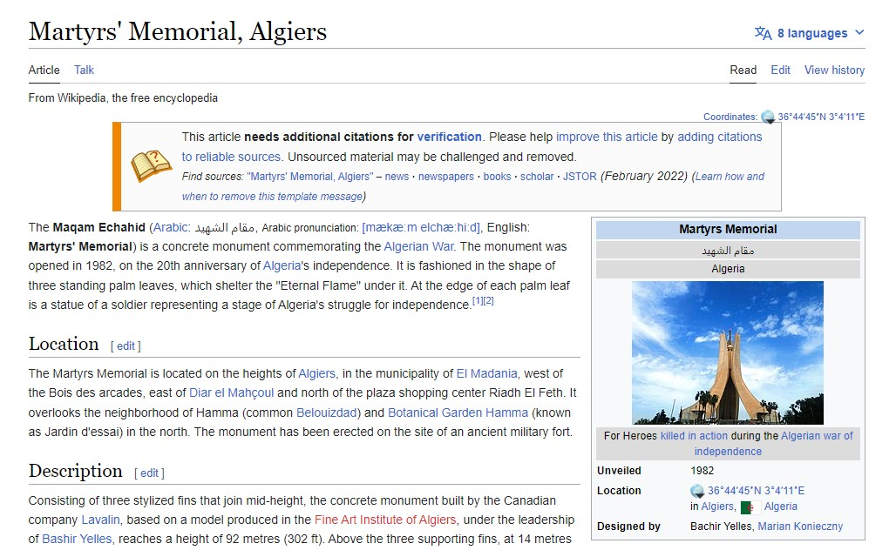
Save the Martyrs Memorial and then use google map.
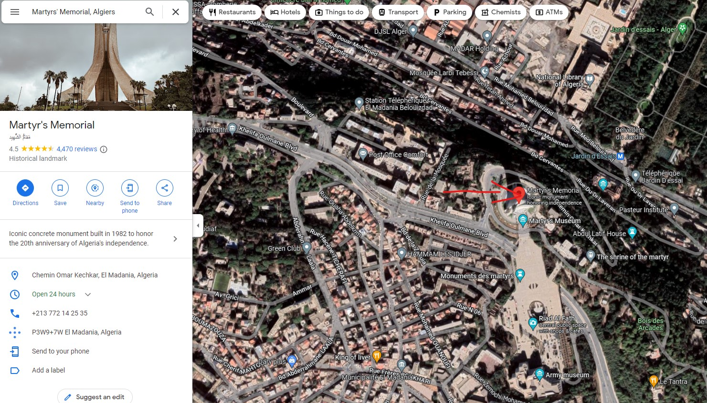
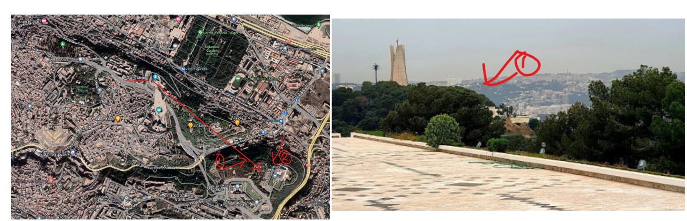
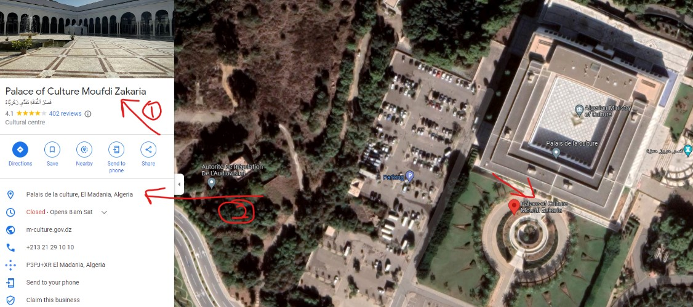
**A-THM{Palais de la culture, El Madania, Algeria}**

**5. Where was that last picture taken?**
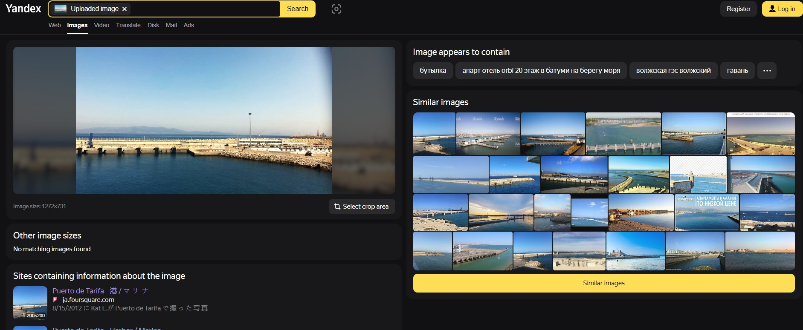
There is no evidence. Let me think about the Rock between Europe and Africa. Try looking at this
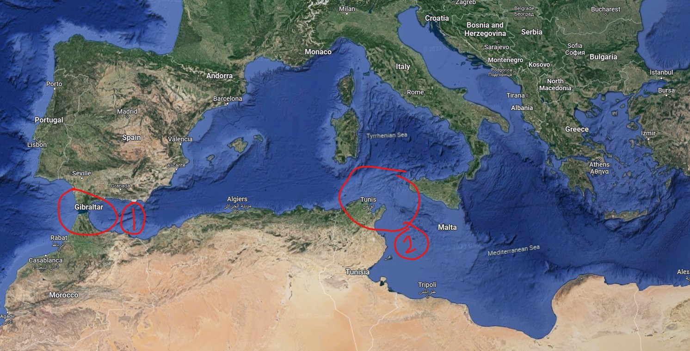
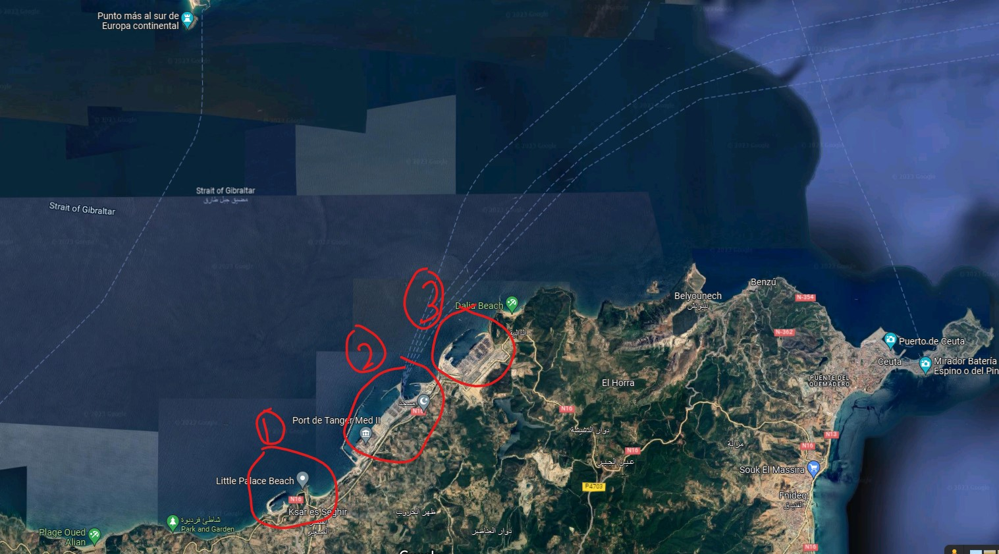
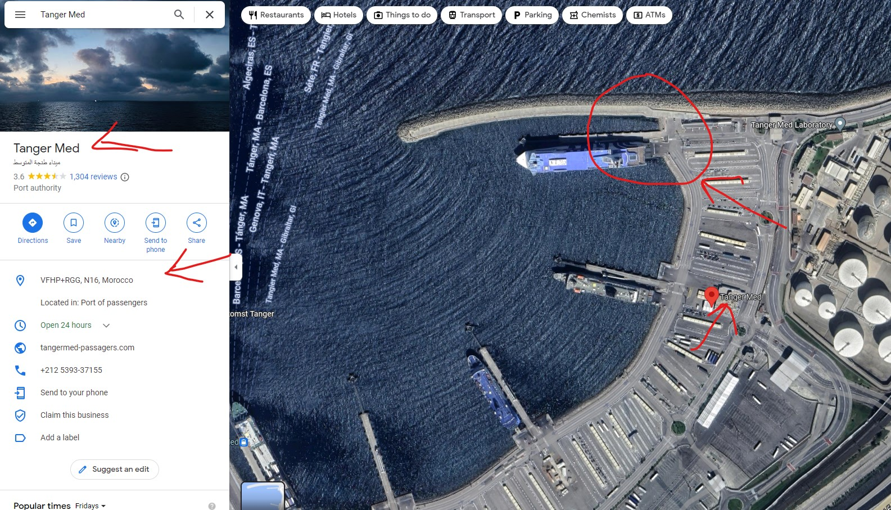
Bingo!
**A-THM{Tanger Med, VFHP+RGG, N16, Morocco}**
