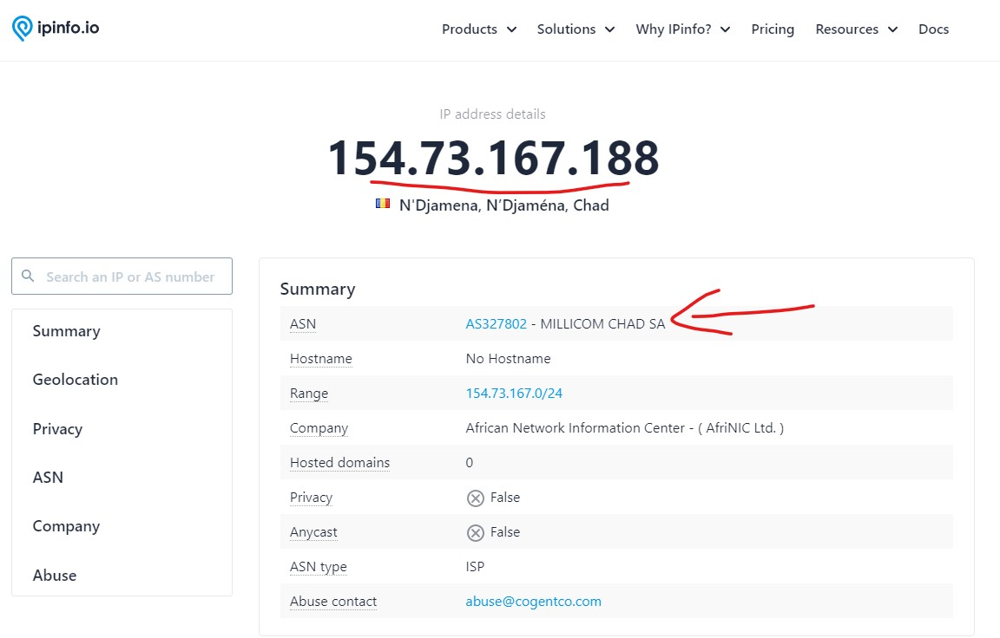
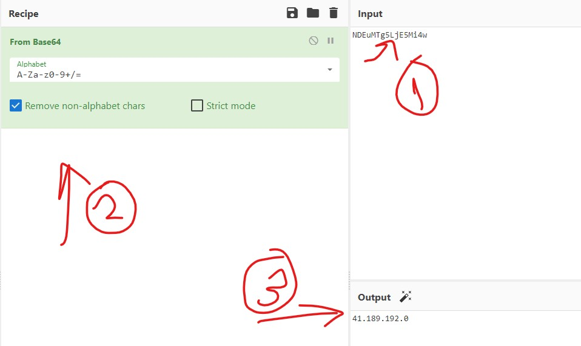
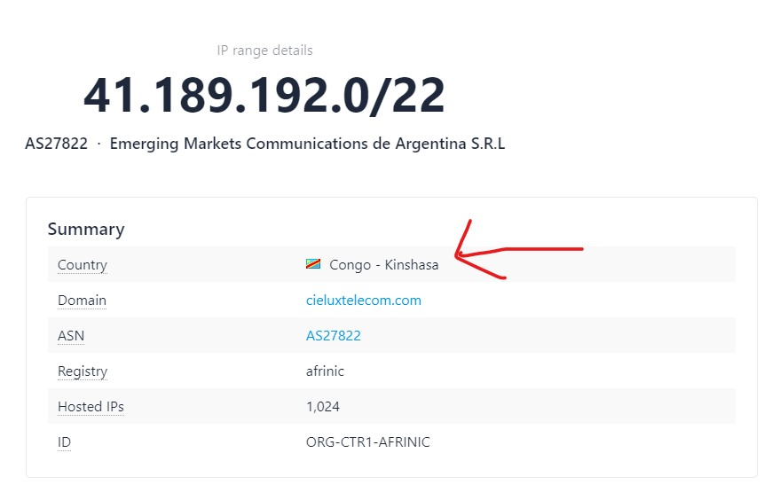
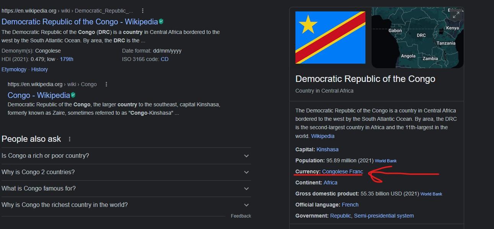
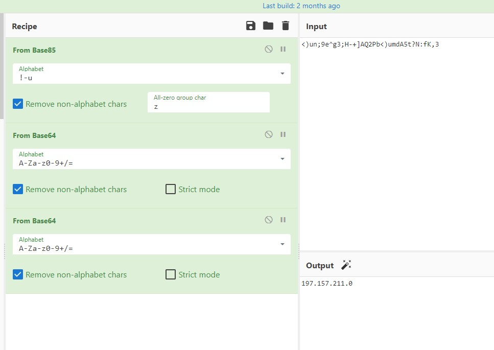
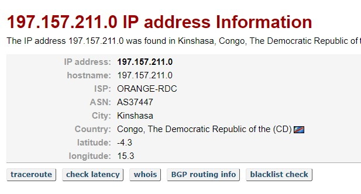
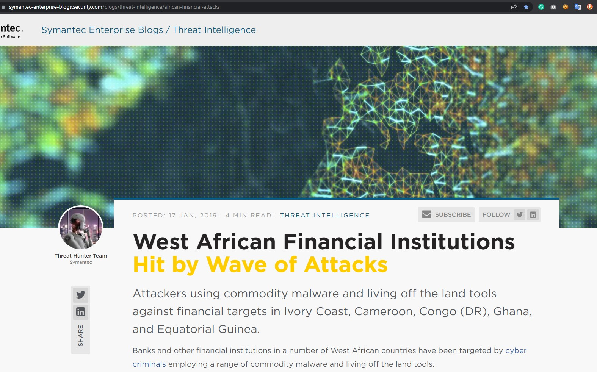
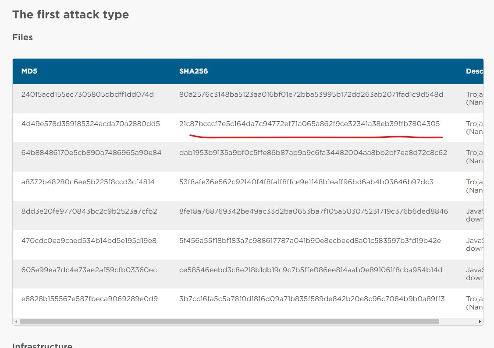
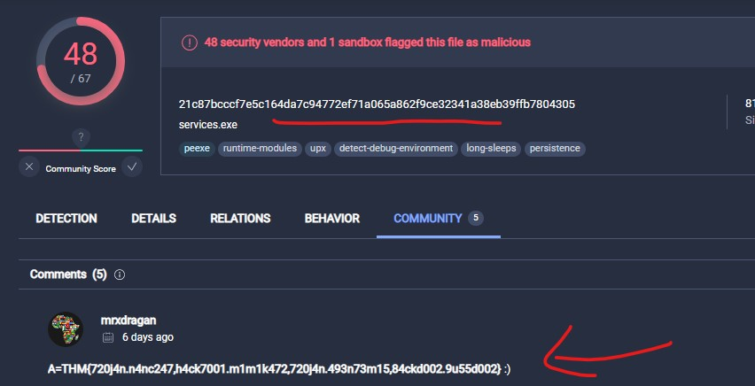

**1. Where the IP Owner 154[.]73[.]167[.]188 is from?**

Using ipinfo.io and see who own Millicom Chad Sa.  
**A-THM{Millicom Chad Sa}**  

**2. Decode the following elements: NDEuMTg5LjE5Mi4w in order to find out what is the country's currency?**  
  
NDEuMTg5LjE5Mi4w from Base64 -> 41.189.192.0  
  

Currency: Congolese Franc  
**A-THM{Congolese Franc}**  

**3. Decode the following; <)un;9e^g3;H-+]AQ2Pb<)umdA5t?N:fK,3 - to identify the Latitude and Longitude encoded?**
  
<)un;9e^g3;H-+]AQ2Pb<)umdA5t?N:fK,3 from Base85, base64, base64 -> 197.157.211.0  
  
**A-THM{-4.3, 15.3}**  

**4. [Research] What are the four types of attacks In Equatorial Guinea and Cameroon that have been carried out since at least mid-2017?**  
  
https://symantec-enterprise-blogs.security.com/blogs/threat-intelligence/african-financial-attacks
  
Find each MD5 or SHA256 and research this on virustotal and every other malicious platform.  
  
**A-THM{720j4n.n4nc247,h4ck7001.m1m1k472,720j4n.493n73m15,84ckd002.9u55d002}**  
