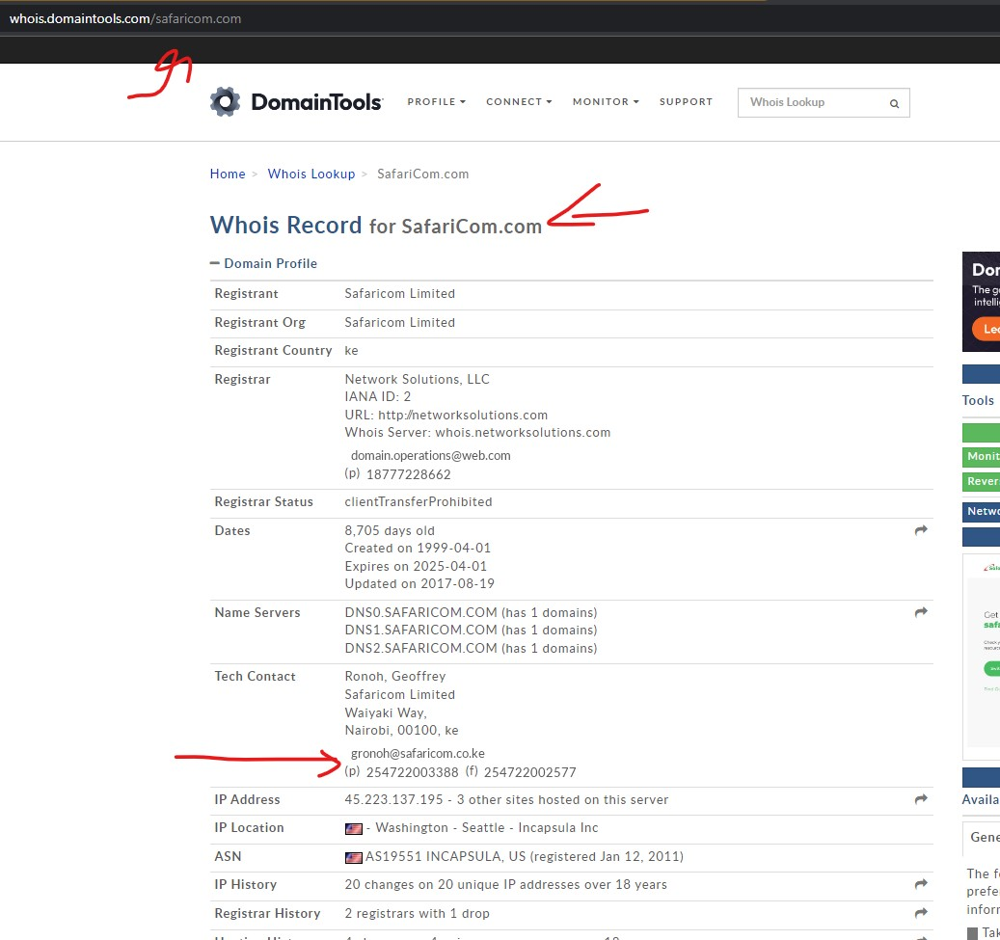
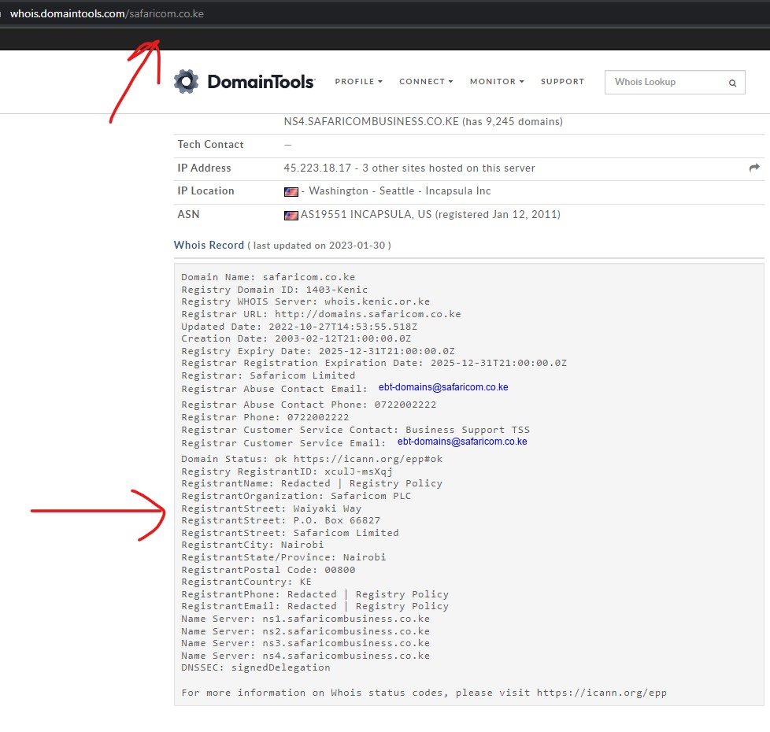
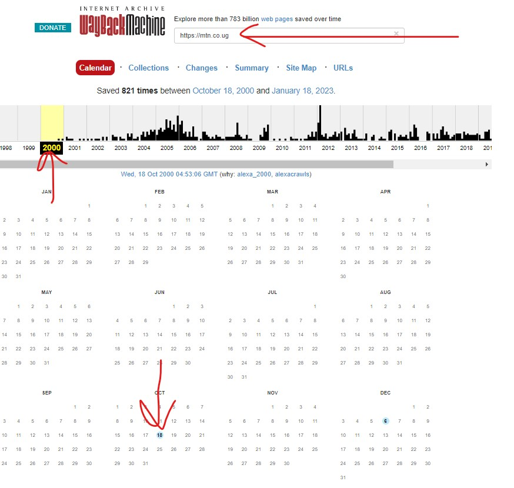
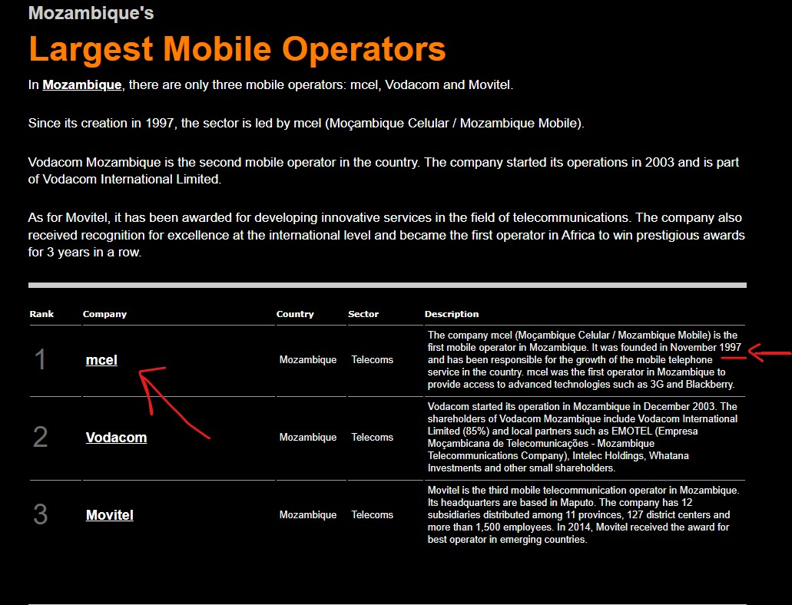
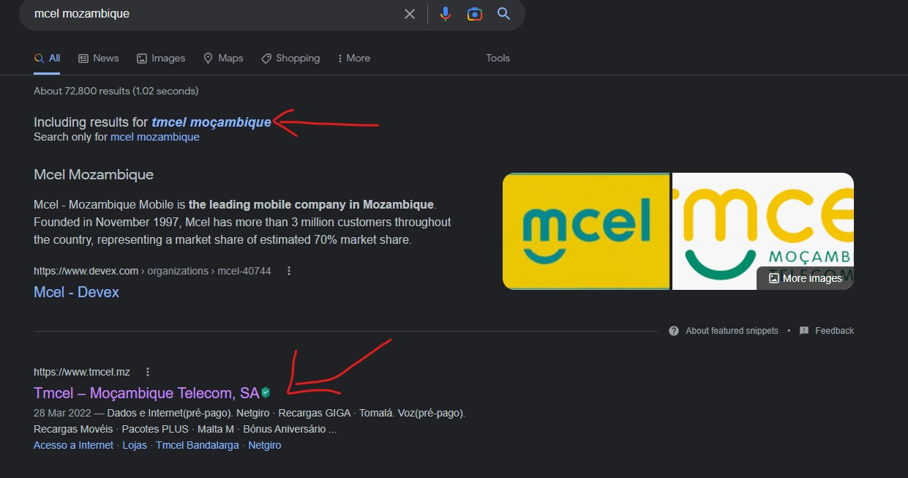
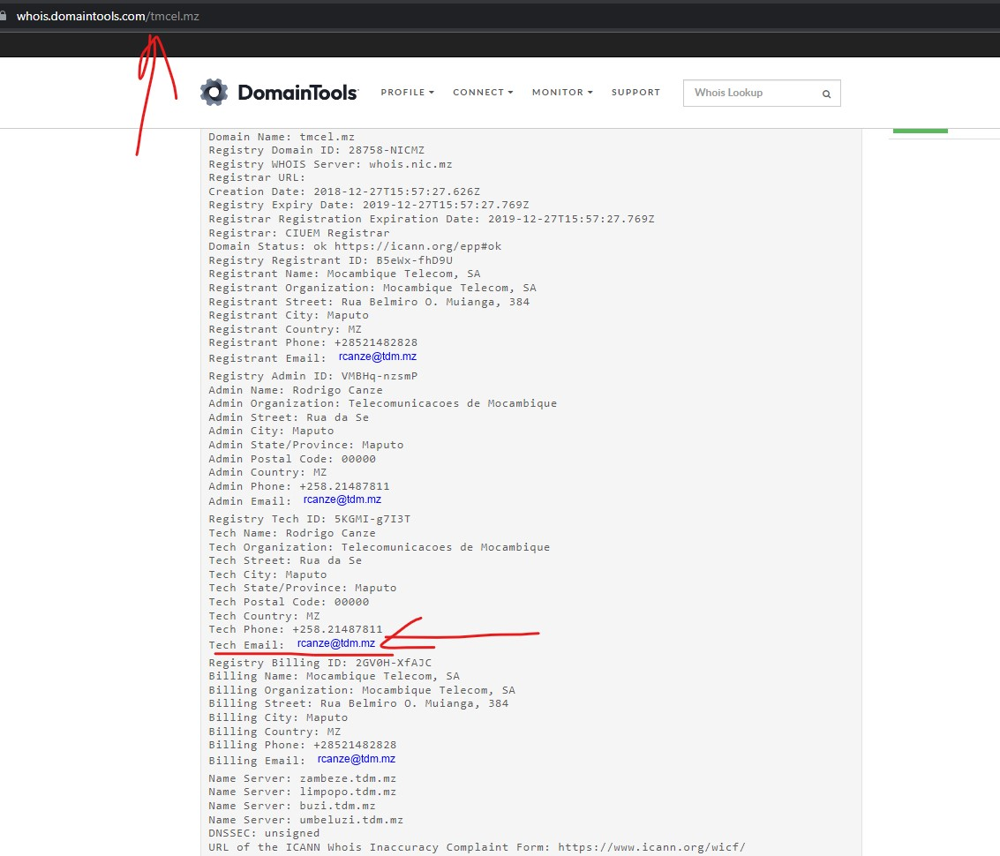
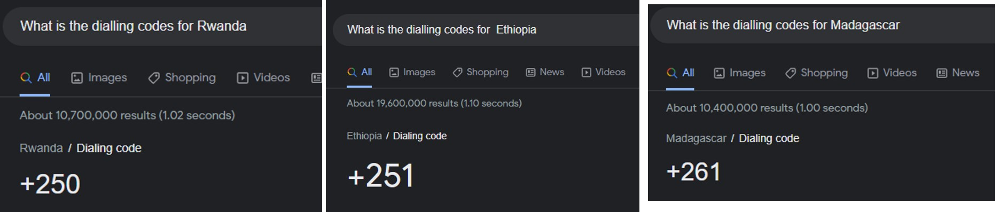
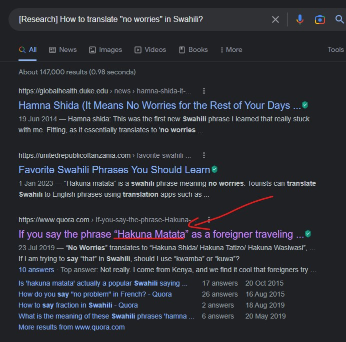

**1. In which city is the street shown on the glitch picture and under what name the street is registered?**  
  
This must be Safaricom. This Safaricom is searched by Whois Record below:
  
Try searching Safaricom[.]co[.]ke  
  
**A-THM{Waiyaki Way, P.O. Box 66827, Safaricom Limited, Nairobi}**  

**2. On what date was the site first captured by the archive? (DD-MM-YYYY) and Using Waybackmachine and do the search mtn[.]co[.]ug**  
  
**A-THM{18-10-2000}**

**3. [Research] Which network was used as the first mobile operator in Mozambique and what was its technical e-mail contact? – Google it**  
  
https://marcopolis.net/top-mobile-operators-in-mozambique.htm
  
Bingo! Found mcel and add “T” letter on the forward word. Tmcel and Try tmcel.mz on whois Domain
  
Found rcanze@idm[.]mz on whois domain tools  
**A-THM{Tmcel, rcanze@tdm[.]mz}**  

**4. What are the dialling codes for Rwanda, Ethiopia, and Madagascar?**
  
**A-THM{+250, +251, +261}**  

**[Research] How to translate "no worries" in Swahili?**  
  
Hakuna Matata translate to 1337 - **A-THM{h4kun4 m47474}**  
