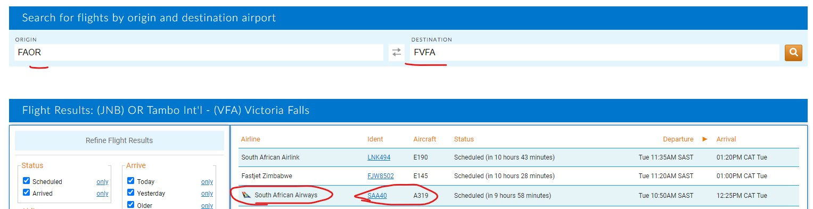
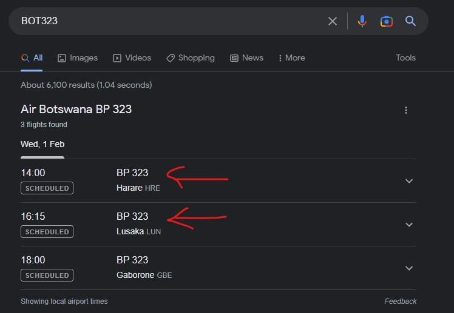
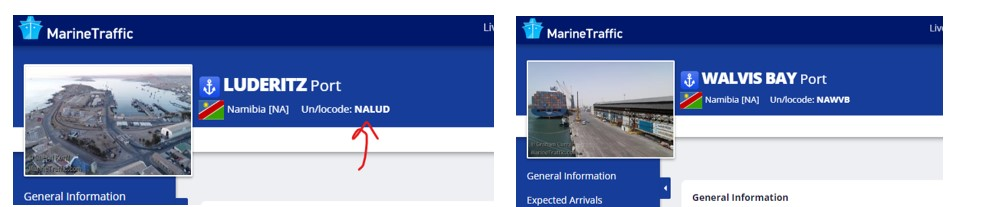

**1. Which airline operates every day flight from Johannesburg to Victoria Falls at 10:50 AM and what is the flight number?**

https://flightaware.com/live/findflight?origin=FAOR&destination=FVFA
**A-THM{South African Airways, SAA40/SA40}**

**2. What is the route of the flight BOT323/BP323?**

**A-THM{LUN Lusaka Zambia, HRE Harare Zimbabwe}**

**3. What UN/LOCODE two ports are in Namibia?**

**A-THM{NAWVB, NALUD}**

**4. Which four of the following are license plates of Eswatini?**

Remember that “OSD”, “HSD”, and “SD” are from Estwatini
Reference:
- https://en.wikipedia.org/wiki/Vehicle_registration_plates_of_Eswatini
- http://www.worldlicenseplates.com/world/AF_ESWA.html

**A-THM{2,3,6,8,9}**
